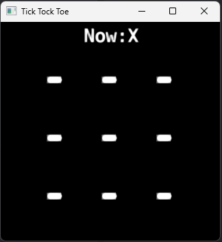

# TICK TOCK TOE

Tick Tock Toe is an implementation of a classic Tic Tac Toe game using immutable tables in Lua.
Immutable tables are described in my open source runtime immutable implementation:

[https://github.com/paweljarosz/lua-immutable](https://github.com/paweljarosz/lua-immutable)



## Game architecture

### Immutable game states

Game is using an immutable table to describe game state. Each input can trigger game logic implementation to modify the state - create a new game state as an immutable table. 

Thanks to this, you can store all game states in a table (stack) and implement undo (and redo) mechanics very easily, like it is presented in `undo_example`.

### Separation into 3 parts

Game is separated into 3 parts (or "streams") in `game` directory:
- input
- logic
- visual

Each part is responsible for separate stuff and each part can have different implementations.

Thanks to this, for example `visual` representation of the game can be:
- simple prints in console, like it is in `visual\console_print.lua`.
- or similarly simple prints but shown on label in Defold project, like it is in `visual\label_print.lua`
- any other custom visual representation converting a board given by game logic implementation to e.g. a proper set of sprites in collection.

Similarly `input` part provides two implementations - for using numeric keys (1-9) to put current mark on board or using mouse input.

You can use different combinations of those parts - use two input methods (mouse + keys), switch visual representation (or also use two of them, GUI + console).

In this repository 3 versions are presented:

#### Simple console based version

Located in `console_game_example` is a version of the game, where numeric keys (1-9) are used (the window with game has to have input focus) to determine where players put the current mark (X or O). Keys in numeric keyboards are usually from left bottom corner to top right corner, so it is kind of a 3x3 representation of the Tic Tac Toe board. The current game state is printed in console simply as a visual ASCII 3x3 board, for example:

```lua
    Current Player: O
    DEBUG:SCRIPT: 1 - - X 
    DEBUG:SCRIPT: 2 - O - 
    DEBUG:SCRIPT: 3 X - - 
```

#### Simple GUI version

Located in `visual_game_example` is a version of the game with script that is literally a copy of the script from console version, but `input` and `visual` modules are replaced with different implementations. Input here is gathered from mouse, so you click on board in game window to select where to put current mark (X or O) and visual representation is presented in game window (using simple Defold label components, so it's very similar to console prints, instead, printed on labels in game window). 


#### Simple GUI version with undo mechanics

Located in `undo_example` is the same version as in visual example, but with additional undo mechanics. The game script is modified to store game states in a table (stack) and additional input handling is added, where `undo` action is recovering previous game state from game history stack:

```lua
	-- Code added to handle undo action:
	if game_logic_input.action == "undo" then
		-- Handle undo action
		if #self.game_states > 1 then
			table.remove(self.game_states)  -- Remove the current state
			self.current_game_state = self.game_states[#self.game_states]
			visual.render(self.current_game_state)
		else
			print("No moves to undo.")
		end
		return
	end
```

And then each game state is added to the game history stack table:

```lua
	-- Code added to save current state in game history stack:
	table.insert(self.game_states, self.current_game_state)
```

## Flow-based Programming inspiration

It's kind of inspired by Flow-based Programming, but I wouldn't say it's "pure" FBP.

Streams here can be presented on a "graph", where each `[ module ]` connects with each other through immutable data:
   `[ input ]` --> `game_logic_input` --> `[ game_logic ]` --> `game_state` --> `[ visual representation ]`

Graph for a `console_game_example` then could look like this:
  `[ input\numeric_keyboard.lua ]` --> `game_logic_input` --> `[ logic\tic_tac_toe.lua ]` --> `new_game_state` --> `[ visual\console_print.lua ]`

  Graph for a `visual_game_example` then could look like this:
  `[ input\mouse.lua ]` --> `game_logic_input` --> `[ logic\tic_tac_toe.lua ]` --> `new_game_state` --> `[ visual\label_print.lua ]`

## Project as Defold library dependency

This project utilises `immutable` Lua implementation and can be used as dependency for you projects, whenever you want to utilise runtime immutability.

Add release version to `Dependency` in your `game.project`, e.g.:

And require immutable module:

```lua
    local IMMUTABLE = require "immutable.immutable"
```

---

If you spot any issue, please report! PRs are welcome too!

---

## License

MIT

Copyright 2024 Paweł Jarosz

Permission is hereby granted, free of charge, to any person obtaining a copy of this software and associated documentation files (the “Software”), to deal in the Software without restriction, including without limitation the rights to use, copy, modify, merge, publish, distribute, sublicense, and/or sell copies of the Software, and to permit persons to whom the Software is furnished to do so, subject to the following conditions:

The above copyright notice and this permission notice shall be included in all copies or substantial portions of the Software.

THE SOFTWARE IS PROVIDED “AS IS”, WITHOUT WARRANTY OF ANY KIND, EXPRESS OR IMPLIED, INCLUDING BUT NOT LIMITED TO THE WARRANTIES OF MERCHANTABILITY, FITNESS FOR A PARTICULAR PURPOSE AND NONINFRINGEMENT. IN NO EVENT SHALL THE AUTHORS OR COPYRIGHT HOLDERS BE LIABLE FOR ANY CLAIM, DAMAGES OR OTHER LIABILITY, WHETHER IN AN ACTION OF CONTRACT, TORT OR OTHERWISE, ARISING FROM, OUT OF OR IN CONNECTION WITH THE SOFTWARE OR THE USE OR OTHER DEALINGS IN THE SOFTWARE.